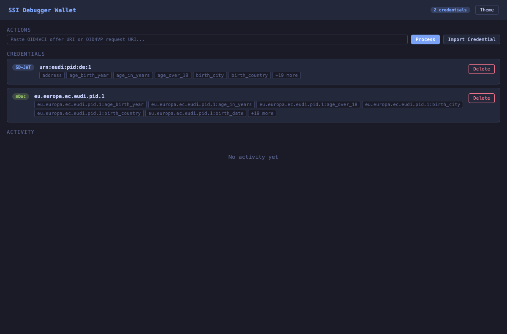
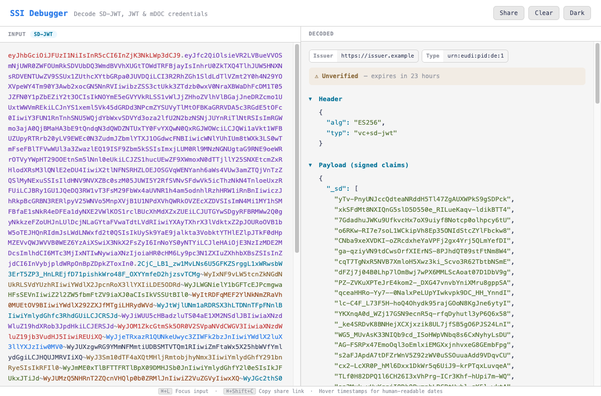

# oid4vc-dev

[](https://github.com/dominikschlosser/oid4vc-dev/actions/workflows/ci.yml)
[](https://github.com/dominikschlosser/oid4vc-dev/releases/latest)

A developer toolkit for OpenID4VC — decode, issue, and present verifiable credentials, run a testing wallet, or proxy live wallet traffic for debugging.

## Highlights

- **Testing Wallet** — stateful CLI wallet with file persistence, OID4VP/VCI flows, QR scanning, and OS URL scheme registration ([wallet](#wallet))
- **Reverse Proxy** — intercept, classify, and decode OID4VP/VCI wallet traffic in real time ([proxy](#proxy))
- **Web UI** — paste, decode, and validate credentials in a split-pane browser interface ([serve](#serve))
- **Unified Decode** — a single `decode` command handles SD-JWT, JWT VC, JWT, mDOC, OID4VCI offers, OID4VP requests, and ETSI trust lists
- **QR Screen Capture** — scan a QR code straight from your screen to decode credentials or OpenID requests ([decode --screen](#decode))
- **Offline Decode & Validate** — SD-JWT, JWT VC, mDOC, JWT with signature verification and trust list support
- **DCQL Generation** — generate Digital Credentials Query Language queries from existing credentials

## Install

### From GitHub Releases

Download the latest binary for your platform from [Releases](https://github.com/dominikschlosser/oid4vc-dev/releases).

### From source

```bash
go install github.com/dominikschlosser/oid4vc-dev@latest
```

### Build locally

```bash
git clone https://github.com/dominikschlosser/oid4vc-dev.git
cd oid4vc-dev
go build -o oid4vc-dev .
```

### Docker

```bash
docker pull ghcr.io/dominikschlosser/oid4vc-dev:latest
docker run -p 8085:8085 ghcr.io/dominikschlosser/oid4vc-dev
```

The default CMD starts the wallet server with pre-loaded PID credentials in headless mode — ready for automated verifier testing out of the box.

→ [Full Docker & verifier testing guide](docs/docker.md)

## Usage

```
oid4vc-dev [--json] [--no-color] [-v] <command> [flags] [input]
```

Input can be a **file path**, **URL**, **raw credential string**, or piped via **stdin**.

### Commands

| Command    | Purpose                                                    |
|------------|------------------------------------------------------------|
| `wallet`   | Stateful testing wallet with CLI-driven OID4VP/VCI flows   |
| `issue`    | Generate test SD-JWT or mDOC credentials for development   |
| `proxy`    | Debugging reverse proxy for OID4VP/VCI wallet traffic      |
| `serve`    | Web UI for decoding and validating credentials in the browser |
| `decode`   | Auto-detect & decode credentials, OpenID4VCI/VP, and trust lists (read-only, no verification) |
| `validate` | Verify signatures, check expiry, and check revocation status |
| `dcql`     | Generate a DCQL query from a credential's claims            |
| `version`  | Print version                                               |

---

### Wallet

A stateful testing wallet with file persistence, CLI-driven OID4VP/VCI flows, QR scanning, and OS URL scheme registration.

```bash
oid4vc-dev wallet generate-pid          # Generate PID credentials
oid4vc-dev wallet serve                 # Start web UI + OID4VP endpoints
oid4vc-dev wallet accept 'openid4vp://authorize?...'
oid4vc-dev wallet scan --screen         # QR scan → auto-dispatch
```

> **Security:** The wallet server exposes unauthenticated HTTP endpoints for credential management and presentation flows. It is designed exclusively for **local development and testing** — never expose it to untrusted networks.

Use `--preferred-format dc+sd-jwt` or `--preferred-format mso_mdoc` to control which credential format is selected when multiple match a DCQL query.



→ [Full documentation](docs/wallet.md) — subcommands, flags, storage, URL scheme registration

---

### Issue

Generate test SD-JWT or mDOC credentials for development and testing.

```bash
oid4vc-dev issue sdjwt --pid
oid4vc-dev issue mdoc --claims '{"name":"Test"}' --doc-type com.example.test
oid4vc-dev issue sdjwt | oid4vc-dev decode
```

→ [Full documentation](docs/issue.md) — all flags, round-trip examples

---

### Proxy

Intercept and debug OID4VP/VCI traffic between a wallet and a verifier/issuer with a live web dashboard.

```bash
oid4vc-dev proxy --target http://localhost:8080
```

```
Wallet  <-->  Proxy (:9090)  <-->  Verifier/Issuer (:8080)
                  |
            Live dashboard (:9091)
```

→ [Full documentation](docs/proxy.md) — traffic classification, features, flags

---

### Serve

Start a local web UI for decoding and validating credentials in the browser.

```bash
oid4vc-dev serve
oid4vc-dev serve --port 3000
oid4vc-dev serve credential.txt
```

Opens a split-pane interface at `http://localhost:8080` (default) with auto-decode on paste, format detection, collapsible sections, signature verification, and dark/light theme. Pass a credential as an argument to pre-fill the input on load.



> **Warning:** Only run locally — credentials are sent to the local server for decoding.

---

### Decode

Auto-detect and decode credentials (SD-JWT, JWT VC, mDOC), OpenID4VCI/VP requests, and ETSI trust lists.

```bash
oid4vc-dev decode credential.txt
oid4vc-dev decode 'openid4vp://authorize?...'
oid4vc-dev decode --screen                    # QR scan from screen
```

→ [Full documentation](docs/decode.md) — auto-detection order, format override, QR scanning, flags

---

### Validate

Verify signatures, check expiry, and check revocation status.

```bash
oid4vc-dev validate --key issuer-key.pem credential.txt
oid4vc-dev validate --trust-list trust-list.jwt credential.txt
oid4vc-dev validate --status-list credential.txt
```

→ [Full documentation](docs/validate.md) — flags, trust list explanation

---

### DCQL

Generate a DCQL (Digital Credentials Query Language) query from a credential's claims. Always outputs JSON.

```bash
oid4vc-dev dcql credential.txt
```

The wallet evaluates `credential_sets` constraints when processing DCQL queries, selecting the best matching option from each set.

**Example output (SD-JWT):**

```json
{
  "credentials": [
    {
      "id": "urn_eudi_pid_1",
      "format": "dc+sd-jwt",
      "meta": { "vct_values": ["urn:eudi:pid:de:1"] },
      "claims": [
        { "path": ["birth_date"] },
        { "path": ["family_name"] },
        { "path": ["given_name"] }
      ]
    }
  ]
}
```

---

## Supported Formats

| Format | Description |
|--------|-------------|
| **SD-JWT** (`dc+sd-jwt`) | Header/payload, disclosures, `_sd` resolution, key binding JWT. Signature: ES256/384/512, RS256/384/512, PS256 |
| **JWT VC** (`jwt_vc_json`) | Plain JWT Verifiable Credentials (W3C JWT VC format). Presented as-is without selective disclosure |
| **mDOC** (`mso_mdoc`) | CBOR IssuerSigned & DeviceResponse (hex/base64url), COSE_Sign1 issuerAuth, MSO |
| **OpenID4VCI / VP** | Credential offers, authorization requests, URI schemes (`openid-credential-offer://`, `openid4vp://`, `haip://`, `eudi-openid4vp://`) |
| **ETSI Trust Lists** | TS 119 602 trust list JWTs with entity names, identifiers, and service types |

## Global Flags

| Flag         | Description              |
|--------------|--------------------------|
| `--json`     | Output as JSON           |
| `--no-color` | Disable colored output   |
| `-v`         | Verbose output (x5c chain, device key, digest IDs) |

## License

Apache-2.0
