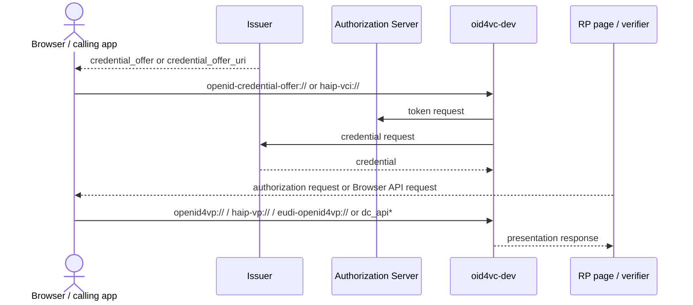
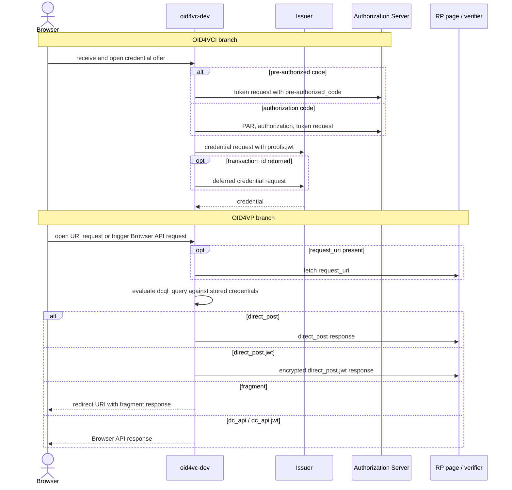

# Flow Diagrams

GitHub renders the diagrams in this section directly from Mermaid source, so the pages stay reviewable in plain text and do not depend on generated image assets.

These diagrams intentionally treat `oid4vc-dev` as a single actor. They show the external interaction pattern and the request parameters or wallet flags that change behavior, not the internal package structure.

## Pages

| Page | Scope |
|------|-------|
| [OID4VP Flows](./oid4vp.md) | Presentation request variants, response modes, Browser API, and request-object handling |
| [OID4VCI Flows](./oid4vci.md) | Credential offer variants, grant flows, and the credential request branches |

## Whole Interaction

## Supported Flow Map

## Reading Guide

- Start with [OID4VCI Flows](./oid4vci.md) if you want to understand how credentials get into the wallet.
- Start with [OID4VP Flows](./oid4vp.md) if you want to understand how the wallet selects and returns stored credentials.
- Use the parameter tables on each page to see which request fields and wallet flags change behavior in `oid4vc-dev`.
