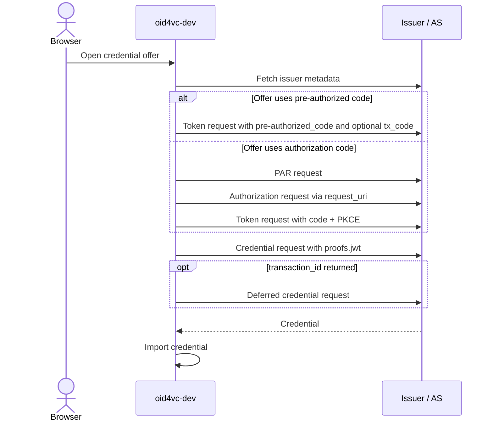
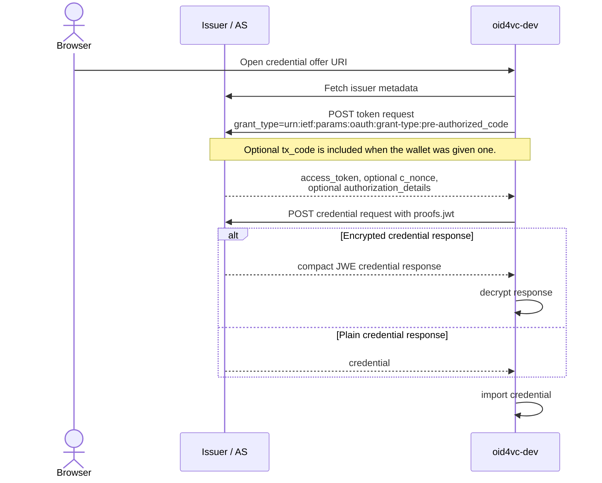
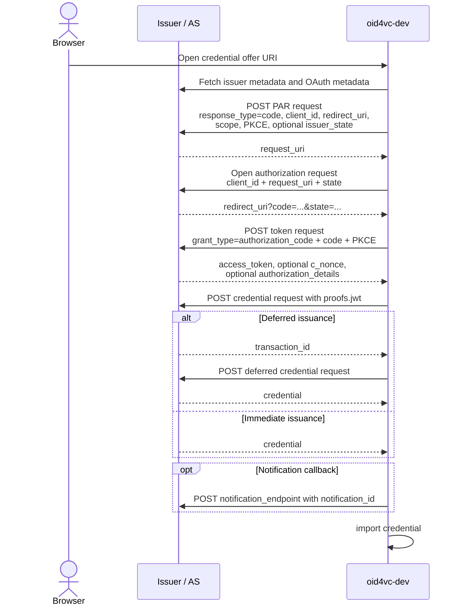

# OID4VCI Flows

This page covers the OID4VCI flows implemented by `oid4vc-dev` when it acts as a wallet receiving a credential offer.

## Flow Map

## Common Inputs

| Field / setting | Why it matters in `oid4vc-dev` |
|-----------------|--------------------------------|
| `credential_offer` or `credential_offer_uri` | One of these must exist for the wallet to start the issuance flow. |
| `credential_issuer` | Used to fetch `/.well-known/openid-credential-issuer` and resolve the token and credential endpoints. |
| `credential_configuration_ids` | The wallet uses the first configuration ID to resolve format and, in the authorization-code flow, the scope. |
| `c_nonce` | Used to bind the credential proof JWT when the issuer or authorization server provides it. |
| `authorization_details[].credential_identifiers` | If present in the token response, `oid4vc-dev` uses `credential_identifier` at the credential endpoint instead of `credential_configuration_id`. |
| Issuer metadata `credential_response_encryption` support | When advertised, the wallet requests encrypted credential responses and decrypts compact JWE responses. |

## Pre-authorized Code Flow

### Relevant Parameters

| Field / setting | Used how |
|-----------------|----------|
| `grants.urn:ietf:params:oauth:grant-type:pre-authorized_code.pre-authorized_code` | Required to choose the pre-authorized code branch. |
| `grants...tx_code` | Optional. If present, the issuer expects an out-of-band transaction code; the wallet can send it via `wallet accept --tx-code ...`. |
| `access_token` | Used to authorize the credential endpoint call. |
| `c_nonce` | If returned, the wallet rebuilds the proof JWT against that nonce. If missing, it may try a nonce endpoint or a first credential request to obtain one. |
| `credential_identifier` vs `credential_configuration_id` | `credential_identifier` wins when the token response exposes it; otherwise the wallet falls back to the first `credential_configuration_id` from the offer. |

## Authorization Code Flow

### Relevant Parameters

| Field / setting | Used how |
|-----------------|----------|
| `oid4vc-dev wallet serve --vci-client-id ...` | Required. The wallet will reject the authorization-code flow without a configured client ID. |
| `oid4vc-dev wallet serve --vci-redirect-uri ...` | Required. The wallet will reject the authorization-code flow without a configured redirect URI. |
| OAuth metadata `pushed_authorization_request_endpoint` | Required. `oid4vc-dev` always uses PAR for this flow. |
| OAuth metadata `authorization_endpoint` | Required for the interactive authorization redirect. |
| OAuth metadata DPoP support | Required. The current auth-code implementation expects DPoP-capable issuer metadata. |
| `credential_configuration_ids[0] -> scope` | The wallet resolves the scope from the selected credential configuration and uses it in PAR. |
| `grants.authorization_code.issuer_state` | If present, forwarded into the PAR request. |
| `token_endpoint_auth_methods_supported` | `oid4vc-dev` supports `private_key_jwt` and `attest_jwt_client_auth` here. Unsupported methods are rejected. |
| `transaction_id` + `deferred_credential_endpoint` | If the credential response is deferred, the wallet follows this branch automatically. |
| `notification_id` + `notification_endpoint` | If both are present, the wallet sends a notification after successful import. |
