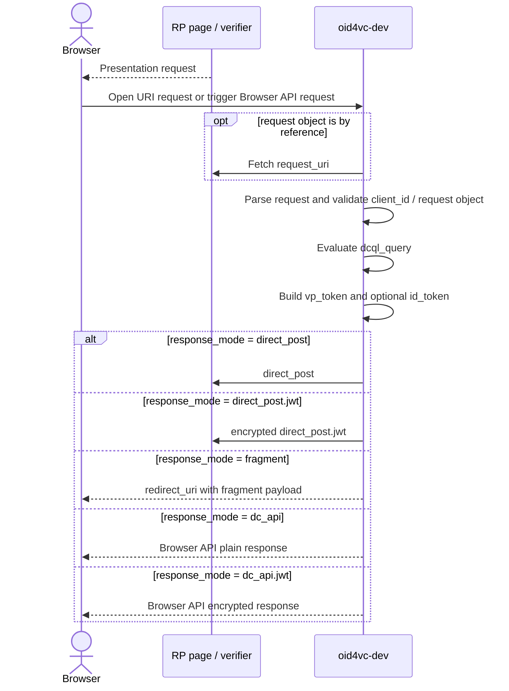
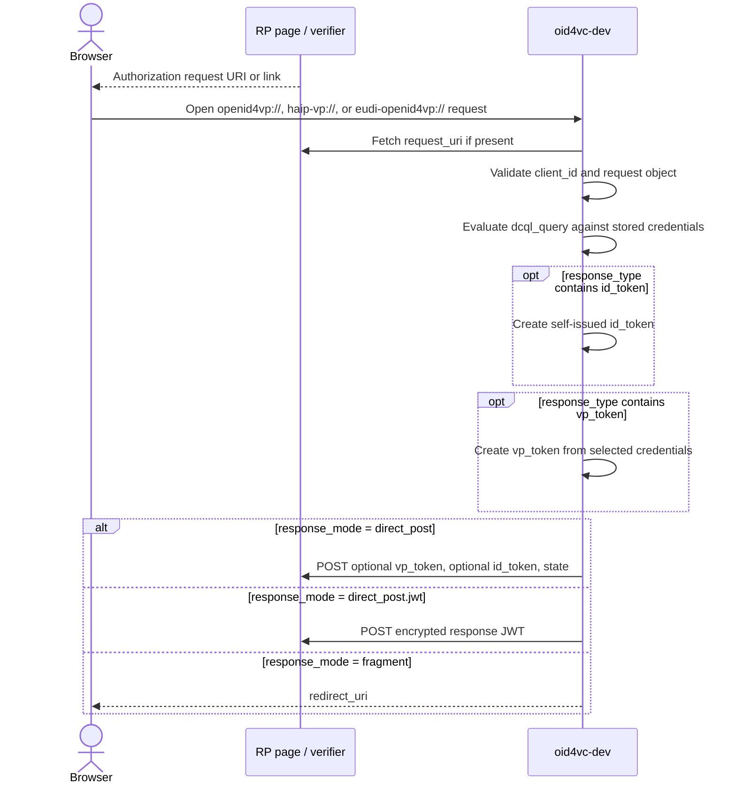
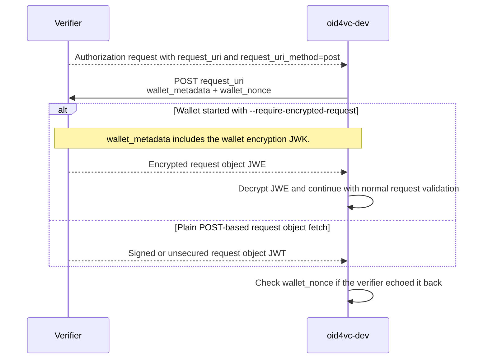
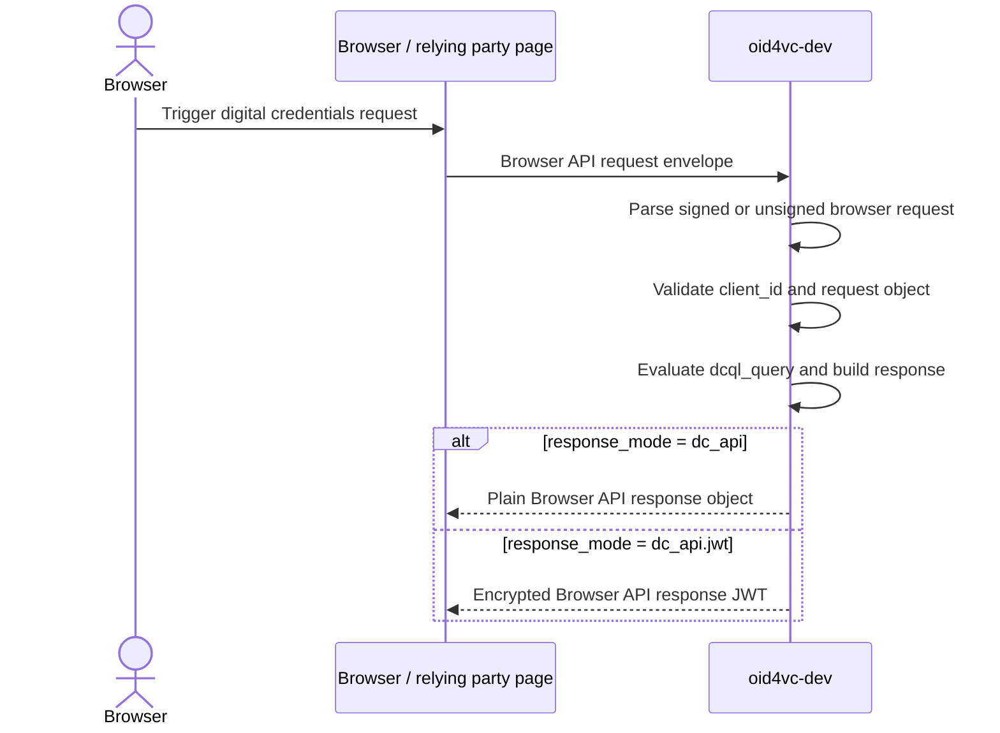

# OID4VP Flows

This page covers the OID4VP presentation flows implemented by `oid4vc-dev` when it acts as a wallet.

## Flow Map

## Common Request Fields

| Field / setting | Why it matters in `oid4vc-dev` |
|-----------------|--------------------------------|
| `client_id` | Always required. `oid4vc-dev` validates the supported client ID scheme. |
| `response_type` | Supports `vp_token`, `vp_token id_token`, and `id_token`. |
| `response_mode` | Drives the response branch: `direct_post`, `direct_post.jwt`, `fragment`, `dc_api`, or `dc_api.jwt`. |
| `nonce` | Bound into SD-JWT key binding JWTs and self-issued `id_token`s. |
| `state` | Reflected in the authorization response when present. |
| `response_uri` | Required for `direct_post` and `direct_post.jwt`. |
| `redirect_uri` | Required for `fragment`. |
| `dcql_query` | Practically required for credential selection in `oid4vc-dev`; this is how the wallet matches stored credentials. |
| `request` or `request_uri` | Used when the verifier sends a request object directly or by reference. |
| `client_metadata` | Important for format negotiation and mandatory for encrypted response modes because `client_metadata.jwks` carries the verifier encryption key. |

## URI-Based Presentation Flow

### Relevant Parameters

| Field / setting | Used how |
|-----------------|----------|
| `response_type=vp_token` | Standard VP-only flow. |
| `response_type=vp_token id_token` | `oid4vc-dev` returns both artifacts. |
| `response_type=id_token` | SIOPv2-only branch without a VP token. |
| `response_mode=direct_post` | Wallet posts a form with plain `vp_token`, optional `id_token`, and `state`. |
| `response_mode=direct_post.jwt` | Wallet requires a verifier encryption key in `client_metadata.jwks` and posts an encrypted response JWT. |
| `response_mode=fragment` | Wallet builds a redirect URL using `redirect_uri`. |
| `--auto-accept` | Skips the consent UI and submits the first matching credentials automatically. |
| `--preferred-format ...` | Accepts `dc+sd-jwt`, `mso_mdoc`, or `jwt_vc_json` and biases selection when more than one stored credential satisfies the same query. |
| `--session-transcript ...` | Accepts `oid4vp` or `iso` and changes how mDoc session transcript data is constructed. |

## `request_uri_method=post` and Encrypted Request Objects

### Relevant Parameters

| Field / setting | Used how |
|-----------------|----------|
| `request_uri` | The wallet dereferences this URI instead of relying only on outer query parameters. |
| `request_uri_method=post` | Switches the request-object fetch from GET to POST. |
| `wallet_metadata` | Sent by `oid4vc-dev`; includes supported formats and signing algorithms, plus an encryption JWK when `--require-encrypted-request` is enabled. |
| `wallet_nonce` | Sent by the wallet for replay protection and checked if returned inside the request object. |
| `--require-encrypted-request` | Makes the wallet advertise an encryption key and require the POSTed `request_uri` response to be a compact JWE. |
| Request object `Content-Type` | `oid4vc-dev` expects `application/oauth-authz-req+jwt` on the POST response. |

## Browser API Flow

### Relevant Parameters

| Field / setting | Used how |
|-----------------|----------|
| Browser API protocol `openid4vp-v1-unsigned` | Unsigned Browser API request branch. |
| Browser API protocol `openid4vp-v1-signed` | Signed Browser API request branch; request data can be a compact JWT or an object containing `request` or `request_uri`. |
| `response_mode=dc_api` | Wallet returns plain JSON through the Browser API response envelope. |
| `response_mode=dc_api.jwt` | Wallet encrypts the response and returns a `response` JWT in the Browser API envelope. |
| `client_id=web-origin:...` | Supported for Browser API verifier identification. |

## Client ID Schemes and Policy Switches

| Item | Behavior in `oid4vc-dev` |
|------|---------------------------|
| `x509_hash:` | Implemented and verified. |
| `x509_san_dns:` | Implemented and verified against the verifier certificate SAN. |
| `redirect_uri:` | Implemented; requires unsigned request objects and must match `response_uri`. |
| `web-origin:` | Implemented for Browser API requests. |
| `verifier_attestation:` | Validated structurally. |
| `decentralized_identifier:` | DID syntax and `kid` cross-check are validated; full DID resolution is not implemented. |
| `--haip` | Tightens incoming VP validation to the currently implemented HAIP subset: encrypted response modes, supported client ID schemes, signed request objects, DCQL, and ES256 request object signatures. |
| Wallet mode `debug` vs `strict` | `debug` logs some request findings and can keep partially matching DCQL credentials; `strict` turns the same issues into hard failures. |
