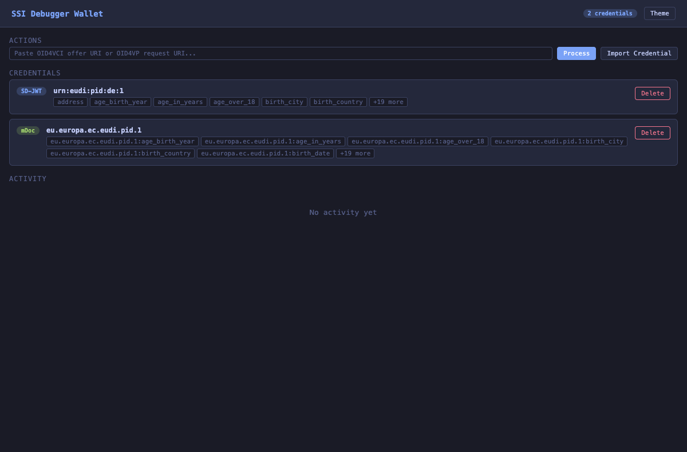

# Wallet

A stateful testing wallet with file persistence, CLI-driven OID4VP/VCI flows, QR scanning, and OS URL scheme registration. Credentials and keys are stored in `~/.oid4vc-dev/wallet/` (configurable via `--wallet-dir`) and persist across invocations.

The wallet has two validation modes:
- `debug` (default) keeps processing requests when possible and logs spec findings for debugging; during DCQL evaluation it warns and keeps a credential match when some required claim paths are missing but other requested claims still match
- `strict` rejects requests that violate the latest final specs

For OpenID Foundation conformance work, see [docs/conformance.md](./conformance.md).

## Subcommands

| Subcommand     | Purpose                                                         |
|----------------|-----------------------------------------------------------------|
| `serve`        | Start wallet HTTP server with web UI, OID4VP endpoints, and optional URL scheme handling |
| `list`         | List stored credentials                                         |
| `show`         | Show a stored credential by ID (raw or decoded)                 |
| `import`       | Import a credential from file, stdin, or raw string (SD-JWT, JWT VC, mDoc) |
| `remove`       | Remove a credential by ID                                       |
| `generate-pid` | Generate default EUDI PID credentials (SD-JWT + mDoc)           |
| `accept`       | Accept an OID4VP presentation request or OID4VCI credential offer (auto-detects) |
| `scan`         | Scan a QR code and auto-dispatch to accept/import               |
| `trust-list`   | Print the trust list JWT (or just the URL with `--url`)         |
| `register`     | Register OS URL scheme handlers (macOS only)                    |
| `unregister`   | Remove OS URL scheme handlers                                   |

## Quick start

```bash
# Generate PID credentials and list them (re-running replaces existing PIDs)
oid4vc-dev wallet generate-pid
oid4vc-dev wallet generate-pid --claims '{"given_name":"MAX","family_name":"POWER"}'
oid4vc-dev wallet list

# Show a credential (raw)
oid4vc-dev wallet show <id>

# Show a credential (human-readable decoded)
oid4vc-dev wallet show --decoded <id>

# Start the wallet web UI with stored credentials
oid4vc-dev wallet serve

# Start the wallet and register URL scheme handlers
oid4vc-dev wallet serve --register

# Process an OID4VP request from the CLI
oid4vc-dev wallet accept 'openid4vp://authorize?client_id=...'

# Accept a credential offer (auto-detected from URI)
oid4vc-dev wallet accept 'openid-credential-offer://...'

# Scan a QR code from screen and auto-detect the flow
oid4vc-dev wallet scan --screen

# Import a credential from a file
oid4vc-dev wallet import credential.txt

# Register URL scheme handlers so openid4vp:// links open the wallet
oid4vc-dev wallet register
```

## Storage

All wallet state is stored in `~/.oid4vc-dev/wallet/` by default:

```
~/.oid4vc-dev/wallet/
├── wallet.json       # Credentials + metadata
├── holder.pem        # Holder EC private key (auto-generated on first use)
└── issuer.pem        # Issuer EC private key (for self-issued credentials)
```

Keys are P-256 EC keys, auto-generated on first use and reused across invocations. On startup, the wallet generates a **CA key** and builds a certificate chain:

1. **CA certificate** — self-signed, used as trust anchor in the trust list (`/api/trustlist`)
2. **Leaf certificate** — signed by the CA, wraps the issuer key's public key

Generated credentials (SD-JWT, JWT, mDoc) are signed with the **issuer key** and include the full certificate chain (`[leaf, CA]`) as `x5c` (JWT header) or `x5chain` (COSE label 33). This mirrors real-world EUDI infrastructure where a verifier validates the credential's certificate chain against a trust list CA, rather than matching a bare public key.

The CA key and certificates are ephemeral (regenerated each time the wallet starts). The issuer key is persisted and reused across invocations.

Generated credentials expire in **30 days** by default. Use `--exp` to override (e.g. `--exp 720h` for 30 days, `--exp 24h` for 1 day). Use `--nbf` to set a not-before time (RFC3339 or duration, e.g. `--nbf 2025-01-15T00:00:00Z` or `--nbf -1h`).



## `wallet show <id>`

Displays a stored credential by its ID (as shown in `wallet list`). By default, outputs the raw credential string. Use `--decoded` for human-readable decoded output (supports `--json` and `-v` global flags).

```bash
oid4vc-dev wallet show <id>                  # Raw credential string
oid4vc-dev wallet show --decoded <id>        # Human-readable output
oid4vc-dev wallet show --decoded --json <id> # JSON output
```

| Flag        | Default | Description                                          |
|-------------|---------|------------------------------------------------------|
| `--decoded` | `false` | Show human-readable decoded output instead of raw    |

## `wallet serve`

Starts a persistent wallet HTTP server with a web UI for managing credentials and handling OID4VP/OID4VCI flows. Loads credentials from disk and saves state on credential changes. Includes request logging with timestamps and a browser-based consent UI for incoming requests.

The server exposes:
- Web UI for credential management and consent
- OID4VP authorization endpoint (`/authorize`)
- ETSI trust list endpoint (`/api/trustlist`) — use this URL as `--trust-list` when validating credentials issued by the wallet

Use `--register` to also register OS URL scheme handlers so that `openid4vp://`, `haip-vp://`, `openid-credential-offer://`, and `haip-vci://` links automatically open the wallet.

```bash
oid4vc-dev wallet serve
oid4vc-dev wallet serve --port 9000 --auto-accept
oid4vc-dev wallet serve --pid --credential extra.txt
oid4vc-dev wallet serve --register           # also register URL scheme handlers
oid4vc-dev wallet serve --register --port 9000
```

| Flag                    | Default  | Description                                      |
|-------------------------|----------|--------------------------------------------------|
| `--port`                | `8085`   | Server port                                      |
| `--auto-accept`         | `false`  | Auto-approve all presentations (headless mode)   |
| `--credential`          | —        | Import credential from file (repeatable)         |
| `--pid`                 | `false`  | Generate default EUDI PID credentials on start   |
| `--key`                 | —        | Override holder key (PEM/JWK)                    |
| `--issuer-key`          | —        | Override issuer key (PEM/JWK)                    |
| `--mode`                | `debug`  | Validation mode: `debug` or `strict`             |
| `--session-transcript`  | `oid4vp` | mDoc session transcript mode: `oid4vp` or `iso`  |
| `--register`            | `false`  | Register OS URL scheme handlers                  |
| `--no-register`         | `false`  | Skip URL scheme registration (overrides --register) |
| `--preferred-format`    | —        | Preferred credential format when multiple match: `dc+sd-jwt`, `mso_mdoc`, or `jwt_vc_json` |
| `--status-list`         | `false`  | Embed status list references in generated credentials |
| `--base-url`            | —        | Base URL for status list endpoint (default: `http://localhost:<port>`) |
| `--docker`              | `false`  | Use `host.docker.internal` instead of `localhost` for `--base-url` |
| `--haip`                      | `false`  | Enforce HAIP 1.0 compliance checks on incoming requests |
| `--require-encrypted-request` | `false` | Require verifiers to encrypt request objects (sends encryption key in `wallet_metadata`) |

## `wallet accept <uri>`

Auto-detects the URI type and dispatches to the appropriate flow:

- `openid4vp://`, `haip-vp://`, `eudi-openid4vp://` → OID4VP presentation (evaluates DCQL, shows consent UI, submits VP token)
  - Supports `response_type=vp_token id_token` (SIOPv2 + OID4VP combined flow) — generates a self-issued ID token alongside the VP token
  - Supports `response_type=id_token` (SIOPv2 only) — generates a self-issued ID token without VP token
- `openid-credential-offer://`, `haip-vci://` → OID4VCI credential issuance (fetches credential from issuer)

In interactive mode (default), OID4VP requests start a temporary consent UI server and auto-open it in the browser. With `--auto-accept`, auto-selects and submits the first matching credentials.

When DCQL is present, `debug` mode is intentionally forgiving for troubleshooting verifier queries: if a credential matches the requested format and metadata and at least one requested claim, the wallet logs a warning and still keeps that credential as a match even when other required claim paths are missing. `strict` mode treats the same query as non-matching.

```bash
oid4vc-dev wallet accept 'openid4vp://authorize?...' --auto-accept
oid4vc-dev wallet accept 'openid-credential-offer://...'
oid4vc-dev wallet accept 'openid-credential-offer://...' --tx-code 123456
```

| Flag                    | Default  | Description                                      |
|-------------------------|----------|--------------------------------------------------|
| `--port`                | `8085`   | Server port for OID4VP                           |
| `--auto-accept`         | `false`  | Auto-approve OID4VP presentations                |
| `--mode`                | `debug`  | Validation mode: `debug` or `strict`             |
| `--session-transcript`  | `oid4vp` | mDoc session transcript mode: `oid4vp` or `iso`  |
| `--tx-code`             | —        | Transaction code for OID4VCI pre-authorized code flow |
| `--haip`                | `false`  | Enforce HAIP 1.0 compliance checks on incoming requests |

Note: only the pre-authorized code grant type is supported. Offers that only contain an `authorization_code` grant will be rejected with a clear error message.

## `wallet scan`

Scans a QR code from an image file or screen capture and auto-detects the content:

- `openid4vp://` → delegates to `accept` (OID4VP presentation)
- `openid-credential-offer://` → delegates to `accept` (OID4VCI issuance)
- SD-JWT / mDoc raw credential → delegates to `import`

```bash
oid4vc-dev wallet scan qr-image.png
oid4vc-dev wallet scan --screen              # macOS interactive screen capture
oid4vc-dev wallet scan --screen --auto-accept # auto-approve if it's a presentation
```

`wallet scan` honors the persistent `wallet --mode` flag when it dispatches OID4VP/VCI flows.

## `wallet trust-list`

Generates and prints the ETSI trust list JWT containing the wallet's CA certificate (trust anchor). The trust list is used by verifiers to validate the x5c/x5chain certificate chain embedded in credentials. The output can be piped to a file or used directly with `--trust-list` in the `validate` command. Use `--url` to print only the URL for a running wallet server instead.

```bash
oid4vc-dev wallet trust-list                          # Print the trust list JWT
oid4vc-dev wallet trust-list > trustlist.jwt          # Save to file
oid4vc-dev wallet trust-list --url                    # http://localhost:8085/api/trustlist
oid4vc-dev wallet trust-list --url --port 9000        # http://localhost:9000/api/trustlist
oid4vc-dev wallet trust-list --url --docker           # http://host.docker.internal:8085/api/trustlist
```

| Flag       | Default | Description                                        |
|------------|---------|----------------------------------------------------|
| `--url`    | `false` | Print only the trust list URL (for a running server) |
| `--port`   | `8085`  | Wallet server port (used with --url)                |
| `--docker` | `false` | Use `host.docker.internal` instead of `localhost` (used with --url) |

## `wallet register` / `wallet unregister`

Registers (or removes) OS-level URL scheme handlers so that `openid4vp://`, `eudi-openid4vp://`, `haip-vp://`, `openid-credential-offer://`, and `haip-vci://` links automatically open the wallet.

The handler script first tries to POST to a running `wallet serve` instance. If the server is not running, it falls back to invoking the CLI directly (`wallet accept`).

- **macOS**: Creates an AppleScript `.app` bundle in `~/Applications/` and registers via Launch Services
- **Other platforms**: Not supported — use `wallet accept <uri>` instead

```bash
oid4vc-dev wallet register               # Register URL handlers (default listener port 8085)
oid4vc-dev wallet register --port 9000   # Use custom listener port
oid4vc-dev wallet unregister             # Remove URL handlers
```

| Flag     | Default | Description                                                    |
|----------|---------|----------------------------------------------------------------|
| `--port` | `8085`  | Listener port for handler script to try before falling back to CLI |

## HAIP 1.0 Enforcement

This wallet currently enforces the implemented **OID4VP subset** of HAIP 1.0. It does not yet implement the full HAIP issuance profile, Wallet Attestation, Key Attestation, or PAR.

Use `--haip` with `wallet serve` or `wallet accept` to enforce [HAIP 1.0 Final](https://openid.net/specs/openid4vc-high-assurance-interoperability-profile-1_0-final.html) compliance on incoming OID4VP requests. When enabled, the wallet rejects requests that violate any of:

- `response_mode` must be `direct_post.jwt`
- `client_id` must use the `x509_hash:` scheme
- A signed request object (JAR) must be present
- The query must use DCQL (not presentation definitions)
- The request object signing algorithm must be `ES256`

Non-compliant requests receive an HTTP 400 error with details about which checks failed.

```bash
oid4vc-dev wallet serve --haip --auto-accept --pid
oid4vc-dev wallet accept --haip 'openid4vp://authorize?...'
```

## Testing API

The wallet server exposes API endpoints for automated testing scenarios. These let you control wallet behavior programmatically — useful for E2E test suites that need to simulate errors or select specific credential formats.

### One-shot error override

Pre-program the wallet to return an error for the next presentation request, even in auto-accept mode. The override is consumed after one use.

**Set override:**

```bash
curl -X POST http://localhost:8085/api/next-error \
  -H 'Content-Type: application/json' \
  -d '{"error": "access_denied", "error_description": "User denied consent"}'
```

The next OID4VP authorization request will return the configured error instead of processing normally:

```json
{
  "status": "error",
  "error": "access_denied",
  "error_description": "User denied consent"
}
```

After that single request, the wallet resumes normal behavior.

**Clear override without consuming:**

```bash
curl -X DELETE http://localhost:8085/api/next-error
```

| Method   | Path              | Body                                                        | Description                |
|----------|-------------------|-------------------------------------------------------------|----------------------------|
| `POST`   | `/api/next-error` | `{"error": "...", "error_description": "..."}`              | Set one-shot error override |
| `DELETE` | `/api/next-error` | —                                                           | Clear override              |

### Preferred credential format

When a DCQL query matches both SD-JWT and mDoc credentials (e.g. both PID formats), the wallet normally picks whichever option appears first. The preferred format setting lets you control which format wins.

**Set preference:**

```bash
curl -X PUT http://localhost:8085/api/config/preferred-format \
  -H 'Content-Type: application/json' \
  -d '{"format": "dc+sd-jwt"}'
```

**Clear preference:**

```bash
curl -X PUT http://localhost:8085/api/config/preferred-format \
  -H 'Content-Type: application/json' \
  -d '{"format": ""}'
```

| Method | Path                           | Body                    | Description                    |
|--------|--------------------------------|-------------------------|--------------------------------|
| `PUT`  | `/api/config/preferred-format` | `{"format": "dc+sd-jwt"}`  | Prefer SD-JWT when multiple match |
| `PUT`  | `/api/config/preferred-format` | `{"format": "mso_mdoc"}`   | Prefer mDoc when multiple match   |
| `PUT`  | `/api/config/preferred-format` | `{"format": "jwt_vc_json"}` | Prefer JWT VC when multiple match |
| `PUT`  | `/api/config/preferred-format` | `{"format": ""}`            | Clear preference (default)        |

The preference can also be set at startup via `--preferred-format`:

```bash
oid4vc-dev wallet serve --auto-accept --pid --preferred-format dc+sd-jwt
```

### Credential import

Credentials can be imported at runtime via `POST /api/credentials`. The body is the raw credential string. Supported formats:

| Format | Detection | Stored as |
|--------|-----------|-----------|
| SD-JWT | Contains `~` separator | `dc+sd-jwt` |
| Plain JWT | 3-part JWT without `~` | `jwt_vc_json` |
| mDoc | CBOR-encoded | `mso_mdoc` |

Plain JWT VCs are presented as-is (no selective disclosure, no KB-JWT). Use `"format": "jwt_vc_json"` in DCQL queries to match them.

```bash
# Import an SD-JWT
curl -X POST http://localhost:8085/api/credentials \
  -d 'eyJhbGciOiJFUzI1NiJ9.eyJ2Y3QiOiJ...~eyJhbGci...~'

# Import a plain JWT VC
curl -X POST http://localhost:8085/api/credentials \
  -d 'eyJhbGciOiJFUzI1NiJ9.eyJ2Y3QiOiJ...'
```

### Status list

When `--status-list` is enabled, generated credentials include a `status.status_list` claim pointing to the wallet's status list endpoint. The URI baked into credentials is `<base-url>/api/statuslist`, where `<base-url>` defaults to `http://localhost:<port>`.

**Important:** If the verifier runs in Docker (or any environment that can't reach `localhost`), use `--docker` (or `--base-url` for a custom URL):

```bash
# Verifier on the same host
oid4vc-dev wallet serve --pid --status-list

# Verifier in Docker (shortcut for --base-url http://host.docker.internal:<port>)
oid4vc-dev wallet serve --pid --status-list --docker

# Custom base URL
oid4vc-dev wallet serve --pid --status-list --base-url http://my-host:8085
```

The status of individual credentials can be changed at runtime:

```bash
# Revoke a credential (status=1)
curl -X POST http://localhost:8085/api/credentials/<id>/status \
  -H 'Content-Type: application/json' \
  -d '{"status": 1}'

# Un-revoke (status=0)
curl -X POST http://localhost:8085/api/credentials/<id>/status \
  -H 'Content-Type: application/json' \
  -d '{"status": 0}'
```

The status list JWT is served at `GET /api/statuslist`.

### Encrypted request objects (`request_uri_method=post`)

OID4VP 1.0 Section 5.10 defines an optional mechanism where the wallet POSTs its capabilities and an encryption key to the verifier's `request_uri` endpoint, instead of using a plain GET. This allows the verifier to encrypt the request object so that only the wallet can read it.

**Note:** This is an OID4VP 1.0 feature. HAIP 1.0 does not mention `wallet_metadata`, `wallet_nonce`, or `request_uri_method`. Use this to test verifiers that support the optional encrypted request object flow.

Enable with `--require-encrypted-request`:

```bash
oid4vc-dev wallet serve --auto-accept --pid --require-encrypted-request
```

When enabled, the wallet:

1. Generates an ECDSA P-256 encryption key at startup
2. When `request_uri_method=post` is set in the authorization request, POSTs to the `request_uri` with:
   - `wallet_metadata` — JSON object containing `vp_formats_supported`, `request_object_signing_alg_values_supported`, and `jwks` with the wallet's public encryption key
   - `wallet_nonce` — base64url-encoded random nonce for replay protection
3. Expects the verifier to encrypt the request object as a JWE (ECDH-ES + A128GCM or A256GCM) using the wallet's public key
4. Decrypts the received JWE to extract the signed JWT request object
5. In `debug` mode, validates that `wallet_nonce` in the response matches the one sent and warns if it is missing
6. In `strict` mode, rejects the flow if the response omits `wallet_nonce`

The proxy dashboard surfaces `request_uri_method`, `wallet_metadata`, and `wallet_nonce` in the decoded traffic view when these fields are present.

Without `--require-encrypted-request`, the wallet still supports `request_uri_method=post` (sending `wallet_metadata` without encryption keys and validating `wallet_nonce`), but does not include encryption keys or attempt JWE decryption.

### Example: E2E test flow

```bash
# 1. Start wallet in headless mode with both PID formats
oid4vc-dev wallet serve --auto-accept --pid --preferred-format dc+sd-jwt &

# 2. Import an additional credential
curl -X POST http://localhost:8085/api/credentials -d @credential.txt

# 3. Run normal presentation (succeeds, uses SD-JWT)
curl -X POST http://localhost:8085/api/presentations \
  -H 'Content-Type: application/json' \
  -d '{"uri": "openid4vp://authorize?..."}'

# 4. Pre-program an error for the next request
curl -X POST http://localhost:8085/api/next-error \
  -H 'Content-Type: application/json' \
  -d '{"error": "access_denied", "error_description": "Simulated denial"}'

# 5. Next presentation returns the error (consumed after one use)
curl -X POST http://localhost:8085/api/presentations \
  -H 'Content-Type: application/json' \
  -d '{"uri": "openid4vp://authorize?..."}'

# 6. Switch to mDoc preference
curl -X PUT http://localhost:8085/api/config/preferred-format \
  -H 'Content-Type: application/json' \
  -d '{"format": "mso_mdoc"}'

# 7. Next presentation uses mDoc instead of SD-JWT
curl -X POST http://localhost:8085/api/presentations \
  -H 'Content-Type: application/json' \
  -d '{"uri": "openid4vp://authorize?..."}'
```

## Shared flag

All wallet subcommands accept `--wallet-dir` to override the storage directory:

```bash
oid4vc-dev wallet list --wallet-dir /tmp/test-wallet
```
