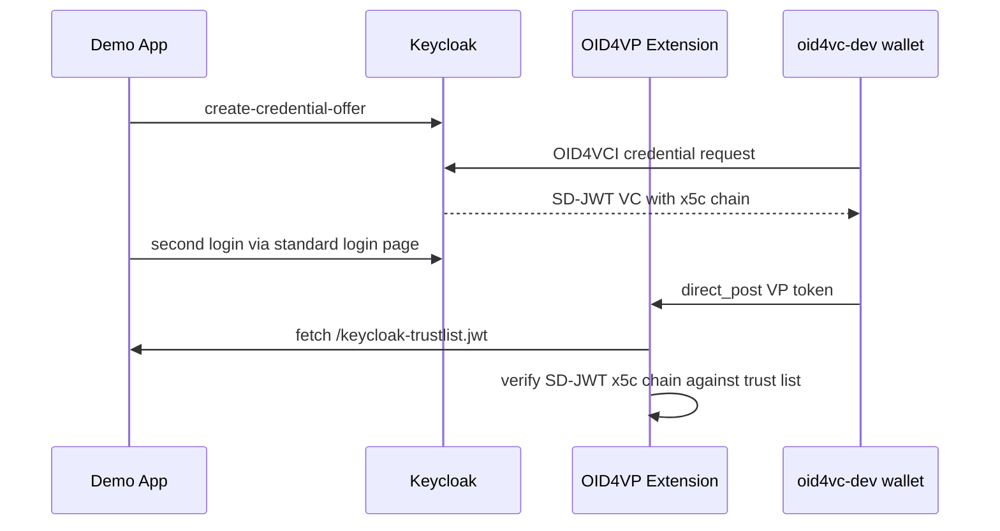
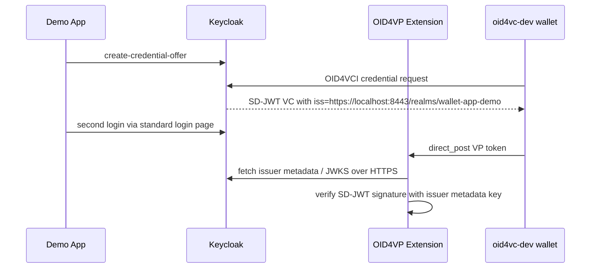

# Keycloak Issuer + Verifier Demo App

This example combines OpenID4VCI issuance and OpenID4VP verification around one Keycloak realm and one small sample application.

It supports two verifier-trust setups:

- `--http`: Keycloak runs on `http://localhost:8080` and the OID4VP extension validates the credential through a generated trust list served by the demo app. This is the default.
- `--https`: Keycloak runs on `https://localhost:8443` and the OID4VP extension resolves the issuer signing key from the VC metadata / issuer metadata endpoints.

VC metadata based trust is the standards-aligned setup and must be served via HTTPS.

## How It Works

### HTTP + Custom Trust List

1. `./start.sh` or `./start.sh --http` downloads `keycloak-extension-oid4vp` `0.6.1`, builds the custom first-broker authenticator, and starts Keycloak on `http://localhost:8080`.
2. `./scripts/bootstrap.sh` creates the realm, users, clients, and first-broker flow, imports a persistent RS256 realm signing key from `keycloak-signing-key.pem` / `keycloak-signing-cert.pem`, then runs `./scripts/generate-keycloak-trustlist.go` to write `keycloak-trustlist.jwt` for that same signing certificate.
3. `./scripts/start-app.sh` runs the local Go app on `http://127.0.0.1:8090` and serves `http://127.0.0.1:8090/keycloak-trustlist.jwt`.
4. The OID4VP identity provider is configured with `trustListUrl=http://host.docker.internal:8090/keycloak-trustlist.jwt`, `trustListLoTEType=http://uri.etsi.org/19602/LoTEType/local`, `trustListMaxCacheTtlSeconds=0`, and `trustListMaxStaleAgeSeconds=0` so Keycloak always refetches the current trust list in this demo setup.
5. The login, issuance, and wallet-login steps are the same as in the HTTPS setup.
6. During wallet login, `keycloak-extension-oid4vp` validates the SD-JWT `x5c` chain against the custom trust list instead of using issuer metadata.

### HTTPS + VC Metadata

1. `./start.sh --https` downloads `keycloak-extension-oid4vp` `0.6.1`, builds the custom first-broker authenticator, generates a local HTTPS certificate for Keycloak, and starts Keycloak on `https://localhost:8443`.
2. `./scripts/bootstrap.sh` creates realm `wallet-app-demo`, registers `keycloak_user_id` in the realm user profile, creates user `alice`, creates the issuance client and app client, configures the `oid4vp` identity provider with `allowedIssuers=https://localhost:8443/realms/wallet-app-demo`, and creates the custom first-broker flow `oid4vp-user-id-auto-link`.
3. `./scripts/start-app.sh` runs the local Go app on `http://127.0.0.1:8090`.
4. A browser login with username/password creates a normal Keycloak app session.
5. The app uses that session's access token to call Keycloak's `create-credential-offer` endpoint and hands the offer to `oid4vc-dev`.
6. The wallet stores the issued credential, including `keycloak_user_id`.
7. After logout, a second login goes through the normal Keycloak login page and can select the wallet option there. `keycloak-extension-oid4vp` verifies the credential by resolving the issuer signing key from the issuer metadata / VC metadata endpoints over HTTPS, and the custom first-broker flow links it back to the existing Keycloak user.

## Flow Diagram

```mermaid
sequenceDiagram
    participant U as User
    participant APP as Demo App
    participant KC as Keycloak 26.6.0
    participant EXT as keycloak-extension-oid4vp 0.6.1
    participant LINK as Custom Broker Authenticator
    participant W as oid4vc-dev wallet

    U->>APP: Login With Password
    APP->>KC: OIDC authorization code flow
    KC-->>APP: app session for alice
    U->>APP: Issue Membership Credential
    APP->>KC: create-credential-offer with app access token
    KC-->>APP: issuer + nonce
    APP->>W: openid-credential-offer://...
    W->>KC: OID4VCI credential request
    KC-->>W: dc+sd-jwt credential with keycloak_user_id
    U->>APP: Logout, then Sign In again
    APP->>KC: OIDC auth via standard login page
    KC->>EXT: start OID4VP broker login
    EXT-->>W: openid4vp:// request
    W->>EXT: direct_post VP token
    EXT->>KC: verified brokered identity with keycloak_user_id
    KC->>LINK: detect existing user by keycloak_user_id
    LINK-->>KC: existing user id
    KC-->>APP: authorization code and tokens for same user
```

## Trust Setup

### HTTP + Custom Trust List



### HTTPS + VC Metadata



## Files

- `start.sh`: runs the full setup; default is HTTP plus the custom trust list, `--https` switches to issuer metadata
- `docker-compose.yml`: starts the HTTP Keycloak setup
- `docker-compose.https.yml`: overrides the base compose file for HTTPS mode
- `scripts/download-extension.sh`: downloads `keycloak-extension-oid4vp` `0.6.1`
- `scripts/build-link-provider.sh`: builds the custom Keycloak first-broker authenticator
- `scripts/generate-keycloak-cert.sh`: generates the local HTTPS certificate for Keycloak in `--https` mode
- `scripts/generate-keycloak-signing-cert.sh`: creates and reuses the persistent Keycloak RS256 signing keypair used in both HTTP and HTTPS mode
- `scripts/generate-keycloak-trustlist.go`: generates `keycloak-trustlist.jwt` from the persistent Keycloak signing certificate in `--http` mode
- `scripts/bootstrap.sh`: configures issuance, verification, user profile, and first-broker flow
- `scripts/start-app.sh`: starts the Go sample app
- `scripts/smoke.py`: runs the complete password-login, issuance, redemption, and wallet-login flow
- `app/main.go`: sample application

## Quick Start

```bash
cd examples/keycloak-issuer-verifier-app
./start.sh
```

If `oid4vc-dev` is not already installed, `start.sh` installs the latest release with `go install github.com/dominikschlosser/oid4vc-dev@latest`.

HTTPS setup:

```bash
./start.sh --http
./start.sh --https
```

Then open `http://127.0.0.1:8090/` and:

1. log in as `alice` / `alice`
2. issue the membership credential
3. open the offer in `oid4vc-dev`
4. log out, sign in again, and choose the wallet option in Keycloak
5. present the credential back to Keycloak

For browser-driven issuance and wallet login on macOS, register the URL handlers once so `openid-credential-offer://` and `openid4vp://` links hand the URI to `oid4vc-dev` and open the wallet UI in interactive mode:

```bash
oid4vc-dev wallet register
```

If you do not register the handler, copy the raw offer/request URI and redeem it manually with `oid4vc-dev wallet accept '<uri>'`.

Headless verification:

```bash
./start.sh --http --smoke
./start.sh --https --smoke
```

Setup only:

```bash
./start.sh --http --setup-only
./start.sh --https --setup-only
```

## Parameters

### Keycloak

| Parameter | HTTP mode | HTTPS mode |
|---|---|
| Image | `quay.io/keycloak/keycloak:26.6.0` | `quay.io/keycloak/keycloak:26.6.0` |
| Base URL | `http://localhost:8080` | `https://localhost:8443` |
| Startup flags | `start-dev`, `--features=oid4vc-vci:v1,oid4vc-vci-preauth-code:v1`, `--http-port=8080`, `--proxy-headers=xforwarded` | `start-dev`, `--features=oid4vc-vci:v1,oid4vc-vci-preauth-code:v1`, `--https-port=8443`, `--proxy-headers=xforwarded`, `--truststore-paths=/opt/keycloak/conf/keycloak-ca-cert.pem`, `--tls-hostname-verifier=ANY`, `--https-certificate-file=/opt/keycloak/conf/keycloak-cert.pem`, `--https-certificate-key-file=/opt/keycloak/conf/keycloak-key.pem` |
| Realm | `wallet-app-demo` | `wallet-app-demo` |
| Admin user | `admin` / `admin` | `admin` / `admin` |
| Demo user | `alice` / `alice` | `alice` / `alice` |
| User-profile attribute | `keycloak_user_id` | `keycloak_user_id` |
| Issuance client | `oid4vc-demo-client` | `oid4vc-demo-client` |
| App client | `wallet-app` | `wallet-app` |
| App redirect URI | `http://127.0.0.1:8090/callback` | `http://127.0.0.1:8090/callback` |
| App client attributes | `pkce.code.challenge.method=S256`, `oid4vci.enabled=true` | `pkce.code.challenge.method=S256`, `oid4vci.enabled=true` |
| Issuance client attributes | `oid4vci.enabled=true`, `pkce.code.challenge.method=S256` | `oid4vci.enabled=true`, `pkce.code.challenge.method=S256` |
| Credential configuration ID | `membership-credential` | `membership-credential` |
| Credential format | `dc+sd-jwt` | `dc+sd-jwt` |
| `vct` | `https://credentials.example.com/membership` | `https://credentials.example.com/membership` |
| Signing algorithm | `RS256` | `RS256` |
| Binding requirement | `vc.binding_required=true` | `vc.binding_required=true` |
| Proof types | `vc.binding_required_proof_types=jwt` | `vc.binding_required_proof_types=jwt` |
| Binding methods | `vc.cryptographic_binding_methods_supported=jwk` | `vc.cryptographic_binding_methods_supported=jwk` |
| Credential identifier | `membership-credential-id` | `membership-credential-id` |
| Credential claims | `keycloak_user_id`, `given_name`, `family_name`, `email`, `preferred_username`, `jti`, `iat` | `keycloak_user_id`, `given_name`, `family_name`, `email`, `preferred_username`, `jti`, `iat` |
| Custom first-broker flow | `oid4vp-user-id-auto-link` | `oid4vp-user-id-auto-link` |
| Custom flow executions | `oid4vp-detect-user-by-id`, `idp-auto-link` | `oid4vp-detect-user-by-id`, `idp-auto-link` |

### `keycloak-extension-oid4vp`

| Parameter | HTTP mode | HTTPS mode |
|---|---|
| Version | `0.6.1` | `0.6.1` |
| Provider alias | `oid4vp` | `oid4vp` |
| `firstBrokerLoginFlowAlias` | `oid4vp-user-id-auto-link` | `oid4vp-user-id-auto-link` |
| `sameDeviceEnabled` | `true` | `true` |
| `crossDeviceEnabled` | `false` | `false` |
| `walletScheme` | `openid4vp://` | `openid4vp://` |
| `responseMode` | `direct_post` | `direct_post` |
| `clientIdScheme` | `plain` | `plain` |
| `enforceHaip` | `false` | `false` |
| `trustedAuthoritiesMode` | `none` | `none` |
| `allowedIssuers` | `http://localhost:8080/realms/wallet-app-demo` | `https://localhost:8443/realms/wallet-app-demo` |
| `trustListUrl` | `http://host.docker.internal:8090/keycloak-trustlist.jwt` | not set |
| Issuer metadata trust | not used | used |
| `statusListMaxCacheTtlSeconds` | `0` | `0` |
| `userMappingClaim` | `keycloak_user_id` | `keycloak_user_id` |
| `userMappingClaimMdoc` | `keycloak_user_id` | `keycloak_user_id` |
| DCQL credential id | `membership_sd_jwt` | `membership_sd_jwt` |
| DCQL format | `dc+sd-jwt` | `dc+sd-jwt` |
| DCQL `vct` | `https://credentials.example.com/membership` | `https://credentials.example.com/membership` |
| DCQL requested claims | `keycloak_user_id`, `given_name`, `family_name`, `email` | `keycloak_user_id`, `given_name`, `family_name`, `email` |

### oid4vc-dev

| Parameter | Value |
|---|---|
| Wallet store | `~/.oid4vc-dev/wallet` |
| Local wallet port in smoke flow | `8085` |

## Useful Overrides

```bash
KEYCLOAK_BASE_URL=http://localhost:8080
KEYCLOAK_CA_CERT=$(pwd)/keycloak-ca-cert.pem
KEYCLOAK_REALM=wallet-app-demo
APP_CLIENT_ID=wallet-app
APP_REDIRECT_URI=http://127.0.0.1:8090/callback
APP_BASE_URL=http://127.0.0.1:8090
OID4VCI_CREDENTIAL_SCOPE=membership-credential
OID4VP_TRUST_MODE=trustlist
OID4VP_TRUST_LIST_URL=http://host.docker.internal:8090/keycloak-trustlist.jwt
KEYCLOAK_TRUST_LIST_PATH=$(pwd)/keycloak-trustlist.jwt
OID4VC_WALLET_PORT=8085
```

## Cleanup

```bash
docker compose down -v
oid4vc-dev wallet remove --all
rm -f keycloak-trustlist.jwt
rm -f keycloak-ca-cert.pem keycloak-ca-key.pem keycloak-cert.pem keycloak-key.pem
```
