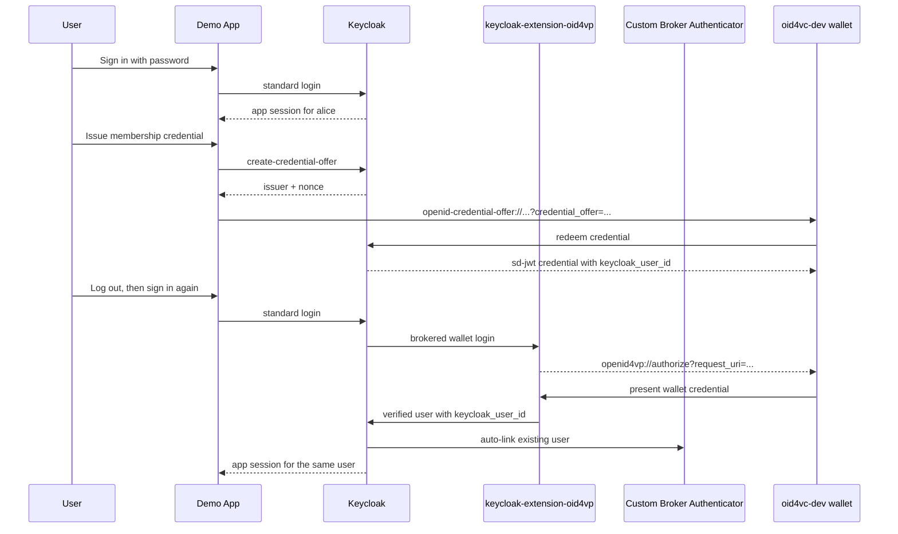
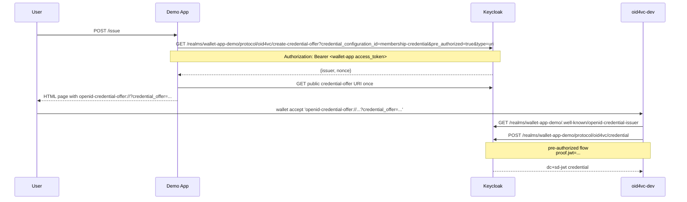
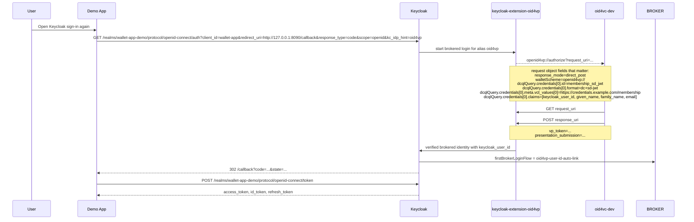

# Keycloak Issuer + Verifier Demo App

This example combines OpenID4VCI issuance and OpenID4VP verification around one Keycloak realm and one small sample application.

Compared with the smaller examples in this directory, this scenario still needs a small dynamic bootstrap for runtime-generated trust material and the persistent signing key. The static realm import already contains the fixed app client, credential scope, custom first-broker flow, OID4VP identity provider, and the wallet-login session-note mapper. The UI itself is kept separate from the Go handlers in `app/templates/` and `app/static/`.

The example supports two verifier-trust setups:

- `--http`: Keycloak runs on `http://localhost:8080` and the OID4VP extension validates the credential through a generated trust list served by the demo app.
- `--https`: Keycloak runs on `https://localhost:8443` and the OID4VP extension resolves the issuer signing key from the VC metadata / issuer metadata endpoints.

The issuance flow is the same in both modes. The only difference is how wallet-login trust is resolved.

## How It Works

The static realm import provides the stable parts of the example. `bootstrap.sh` fills in the runtime parts: the persistent RS256 signing key, the generated trust list in HTTP mode, and the HTTP-only admin setting for the local demo.

### Trust Modes

- HTTP mode uses `http://host.docker.internal:8090/keycloak-trustlist.jwt` and `trustListLoTEType=http://uri.etsi.org/19602/LoTEType/local`.
- HTTPS mode uses `allowedIssuers=https://localhost:8443/realms/wallet-app-demo` and fetches issuer metadata / JWKS over HTTPS.

## High-Level Flow



## Detailed Flows

### Issuance



### Verification



## Files

- `start.sh`: runs the full setup; default is HTTP plus the custom trust list, `--https` switches to issuer metadata
- `docker-compose.yml`: starts the HTTP Keycloak setup and imports the base realm from `realm/`
- `docker-compose.https.yml`: overrides the base compose file for HTTPS mode
- `realm/wallet-app-demo-realm.json`: source-of-truth base realm with the static user, app client, and credential scope
- `scripts/download-extension.sh`: downloads `keycloak-extension-oid4vp` `0.6.1`
- `scripts/build-link-provider.sh`: builds the custom Keycloak first-broker authenticator
- `scripts/generate-keycloak-cert.sh`: generates the local HTTPS certificate for Keycloak in `--https` mode
- `scripts/generate-keycloak-signing-cert.sh`: creates and reuses the persistent Keycloak RS256 signing keypair used in both HTTP and HTTPS mode
- `scripts/generate-keycloak-trustlist.go`: generates `keycloak-trustlist.jwt` from the persistent Keycloak signing certificate in `--http` mode
- `scripts/bootstrap.sh`: configures issuance, verification, user profile, and first-broker flow
- `scripts/start-app.sh`: starts the Go sample app
- `scripts/smoke.py`: runs the complete password-login, issuance, redemption, and wallet-login flow
- `app/main.go`: sample application routes and OIDC flow handling
- `app/templates/`: external HTML templates for the demo UI
- `app/static/`: CSS for the demo UI

## Why Inline `credential_offer`

This example uses the OpenID4VCI by-value `credential_offer` form instead of handing wallets a `credential_offer_uri`.

- OpenID4VCI allows both by-value and by-reference offers.
- The Keycloak `create-credential-offer` endpoint in 26.6 creates an internal offer URI and does not directly return by-value JSON.
- Some external wallets dereference `credential_offer_uri` more than once across parse and issuance steps.
- Current Keycloak behavior for that generated offer URI is effectively one-shot in this flow, so the second fetch fails with `invalid_credential_offer_request`.
- The example therefore resolves the offer once server-side and gives the wallet an inline `credential_offer=...` URI instead.
- The demo realm also omits `vc.credential_identifier`, so wallets that still request credentials by `credential_configuration_id` continue to interoperate. With that attribute set, Keycloak 26.6 requires a final `credential_identifier` field on the credential request.

## Quick Start

```bash
cd examples/keycloak-issuer-verifier-app
./start.sh
```

If `oid4vc-dev` is not already installed, `start.sh` installs the latest release with `go install github.com/dominikschlosser/oid4vc-dev@latest`.

HTTP / HTTPS setup:

```bash
./start.sh --http
./start.sh --https
```

Then open `http://127.0.0.1:8090/` and:

1. log in as `alice` / `alice`
2. issue the membership credential
3. open the offer in `oid4vc-dev`
4. log out, sign in again, and choose the wallet option in Keycloak
5. present the credential back to Keycloak

`./start.sh` runs `oid4vc-dev wallet register` automatically. On macOS that installs the custom scheme handlers so `openid-credential-offer://` and `openid4vp://` links hand the URI to `oid4vc-dev` and open the wallet UI in interactive mode. On Linux and Windows the command is a no-op.

If your system does not handle the custom scheme directly:

- issuance: use the offer page in the demo app and run the printed `oid4vc-dev wallet accept '<openid-credential-offer://...>'` command
- verification: when Keycloak shows the wallet login page, copy the `openid4vp://...` link target and run `oid4vc-dev wallet accept '<openid4vp://...>'`

Manual registration is still available if you want to run it yourself:

```bash
oid4vc-dev wallet register
```

Headless verification:

```bash
./start.sh --http --smoke
./start.sh --https --smoke
```

Setup only:

```bash
./start.sh --http --setup-only
./start.sh --https --setup-only
```

## Useful Overrides

```bash
KEYCLOAK_BASE_URL=http://localhost:8080
KEYCLOAK_CA_CERT=$(pwd)/keycloak-ca-cert.pem
KEYCLOAK_REALM=wallet-app-demo
APP_CLIENT_ID=wallet-app
APP_REDIRECT_URI=http://127.0.0.1:8090/callback
APP_BASE_URL=http://127.0.0.1:8090
OID4VCI_CREDENTIAL_SCOPE=membership-credential
OID4VP_TRUST_MODE=trustlist
OID4VP_TRUST_LIST_URL=http://host.docker.internal:8090/keycloak-trustlist.jwt
KEYCLOAK_TRUST_LIST_PATH=$(pwd)/keycloak-trustlist.jwt
OID4VC_WALLET_PORT=8085
```

## Cleanup

```bash
docker compose down -v
oid4vc-dev wallet remove --all
rm -f keycloak-trustlist.jwt
rm -f keycloak-ca-cert.pem keycloak-ca-key.pem keycloak-cert.pem keycloak-key.pem
```
