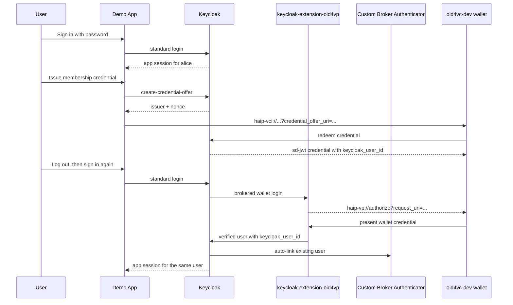
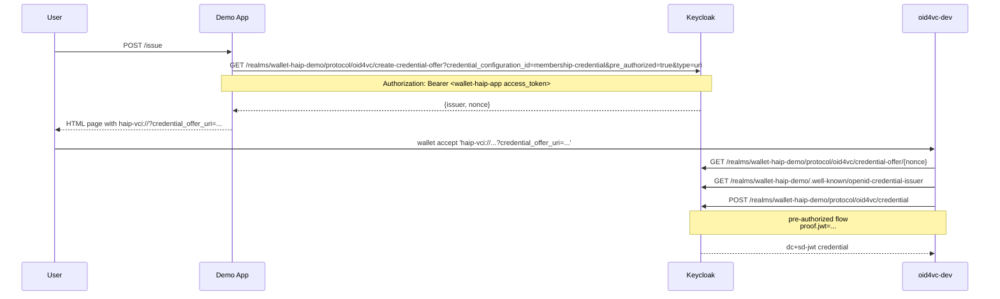
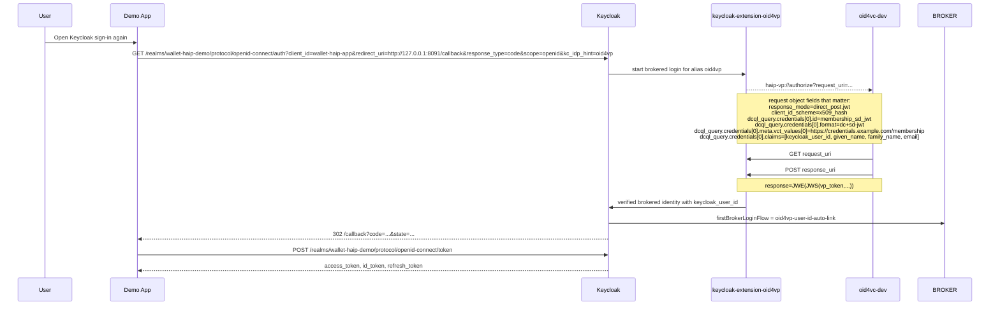

# Keycloak Issuer + Verifier HAIP Demo

This example mirrors [`keycloak-issuer-verifier-app`](../keycloak-issuer-verifier-app/README.md), but switches the verifier side to HAIP-style OID4VP:

- `haip-vp://`
- `response_mode=direct_post.jwt`
- `client_id_scheme=x509_hash`
- signed Request Objects with an X.509 certificate and ES256 key
- trust-list based issuer trust

The example stays on local HTTP to keep the setup small. In a production-style deployment, the verifier `request_uri` endpoint would normally be HTTPS.

## How It Works

The static realm import provides the stable parts of the example. `bootstrap.sh` fills in the runtime parts: the persistent Keycloak signing key, the generated trust list, the verifier certificate chain and signing key for `x509_hash`, and the real `keycloak_user_id` value for `alice`.

The UI follows the same structure as the baseline example: Go handlers in `app/main.go`, templates in `app/templates/`, and CSS in `app/static/`.

### HAIP Deviations

This is not full HAIP issuance yet.

- Issuance still uses a pre-authorized credential offer, not authorization-code issuance.
- The app hands the wallet a `haip-vci://` URI, but the underlying Keycloak offer still contains a pre-authorized grant.
- The verifier side is the HAIP part of this example. That is the supported end-to-end flow today.

## High-Level Flow



## Detailed Flows

### Issuance



### Verification



## Files

- `start.sh`: runs the full setup and starts the demo app on `http://127.0.0.1:8091`
- `docker-compose.yml`: starts Keycloak and imports the base realm from `realm/`
- `realm/wallet-haip-demo-realm.json`: source-of-truth base realm with the static user, app client, and credential scope
- `scripts/download-extension.sh`: downloads `keycloak-extension-oid4vp` `0.6.1`
- `scripts/build-link-provider.sh`: builds the custom Keycloak first-broker authenticator
- `scripts/generate-keycloak-signing-cert.sh`: creates and reuses the persistent Keycloak RS256 signing keypair
- `scripts/generate-keycloak-trustlist/main.go`: generates `keycloak-trustlist.jwt` from the persistent Keycloak signing certificate
- `scripts/generate-verifier-material/main.go`: generates the verifier certificate chain and ES256 signing JWK used for `x509_hash`
- `scripts/bootstrap.sh`: configures issuance, verification, user profile, and HAIP verifier material
- `scripts/start-app.sh`: starts the Go sample app
- `scripts/smoke.py`: runs the complete password-login, issuance, redemption, and wallet-login flow
- `app/main.go`: sample application routes and OIDC flow handling
- `app/templates/`: external HTML templates for the demo UI
- `app/static/`: CSS for the demo UI

## Quick Start

```bash
cd examples/keycloak-issuer-verifier-haip-app
./start.sh
```

If `oid4vc-dev` is not already installed, `start.sh` installs the latest release with `go install github.com/dominikschlosser/oid4vc-dev@latest`.

Then open `http://127.0.0.1:8091/` and:

1. log in as `alice` / `alice`
2. issue the membership credential
3. open the offer in `oid4vc-dev`
4. log out, sign in again, and choose the wallet option in Keycloak
5. present the credential back to Keycloak

`./start.sh` runs `oid4vc-dev wallet register` automatically. On macOS that installs the custom scheme handlers so `haip-vci://` and `haip-vp://` links hand the URI to `oid4vc-dev` and open the wallet UI in interactive mode. On Linux and Windows the command is a no-op.

If your system does not handle the custom scheme directly:

- issuance: use the offer page in the demo app and run the printed `oid4vc-dev wallet accept '<haip-vci://...>'` command
- verification: when Keycloak shows the wallet login page, copy the `haip-vp://...` link target and run `oid4vc-dev wallet accept '<haip-vp://...>'`

Manual registration is still available if you want to run it yourself:

```bash
oid4vc-dev wallet register
```

Headless verification:

```bash
./start.sh --smoke
```

Setup only:

```bash
./start.sh --setup-only
```

## Useful Overrides

```bash
KEYCLOAK_BASE_URL=http://localhost:8081
KEYCLOAK_REALM=wallet-haip-demo
APP_CLIENT_ID=wallet-haip-app
APP_REDIRECT_URI=http://127.0.0.1:8091/callback
APP_BASE_URL=http://127.0.0.1:8091
OID4VCI_CREDENTIAL_SCOPE=membership-credential
OID4VP_TRUST_LIST_URL=http://host.docker.internal:8091/keycloak-trustlist.jwt
KEYCLOAK_TRUST_LIST_PATH=$(pwd)/keycloak-trustlist.jwt
VERIFIER_CERT_CHAIN_PATH=$(pwd)/verifier-cert-chain.pem
VERIFIER_CA_CERT_PATH=$(pwd)/verifier-ca-cert.pem
VERIFIER_SIGNING_KEY_JWK_PATH=$(pwd)/verifier-signing-key.jwk
OID4VC_WALLET_PORT=8085
```

## Cleanup

```bash
docker compose down -v
oid4vc-dev wallet remove --all
rm -f keycloak-trustlist.jwt
rm -f verifier-ca-cert.pem verifier-cert-chain.pem verifier-signing-key.jwk
```
