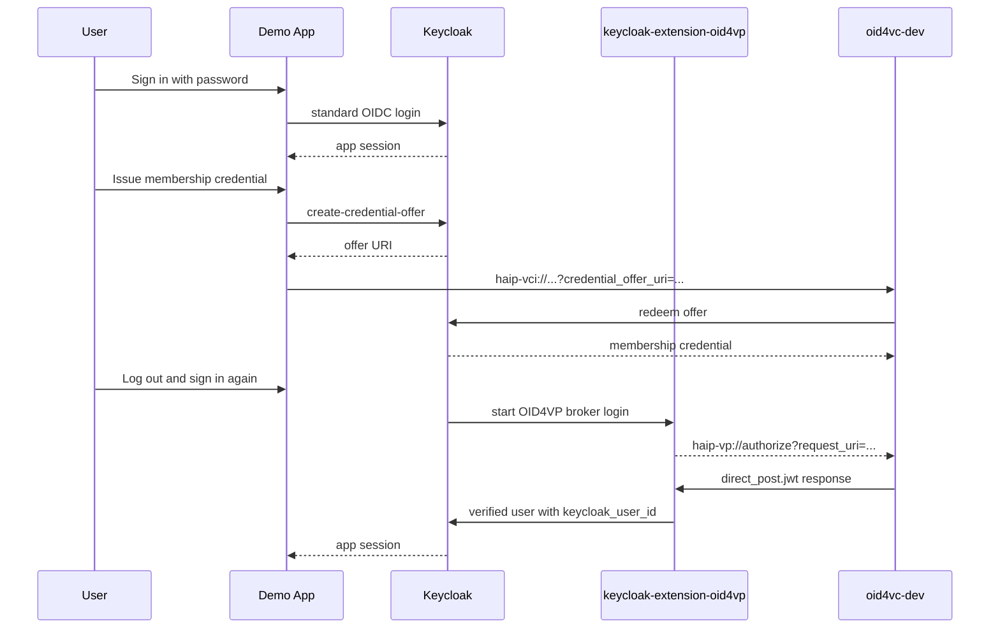
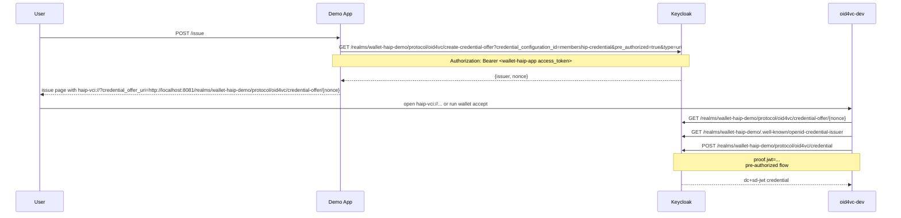
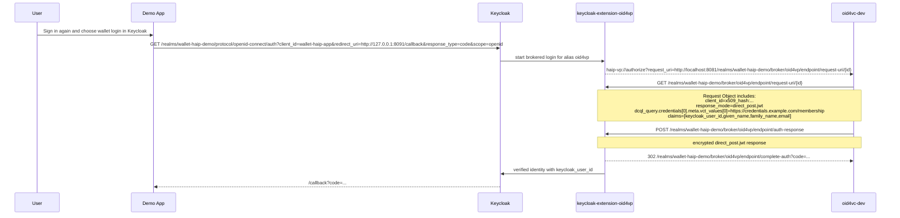

# Keycloak Issuer + Verifier HAIP Demo

This example mirrors [`keycloak-issuer-verifier-app`](../keycloak-issuer-verifier-app/README.md), but switches the verifier side to HAIP-style OID4VP:

- `haip-vp://`
- `response_mode=direct_post.jwt`
- `client_id_scheme=x509_hash`
- signed Request Objects with an X.509 certificate and ES256 key
- trust-list based issuer trust

The example intentionally stays on local HTTP. That keeps the setup small and focuses on the HAIP-specific verifier behavior. In a production-style deployment, the verifier `request_uri` endpoint would normally be HTTPS.

## Deviations

This is not full HAIP issuance yet.

- Issuance still uses a pre-authorized credential offer, not authorization-code issuance.
- The app hands the wallet a `haip-vci://` URI, but the underlying Keycloak offer still contains a pre-authorized grant.
- The verifier side is the HAIP part of this example. That is the supported end-to-end flow today.

## High-Level Flow



## Issuance



## Verification



## What Bootstrap Does

The imported realm already contains the static pieces:

- demo user `alice`
- public app client `wallet-haip-app`
- credential scope `membership-credential`
- custom first-broker flow
- OID4VP identity provider stub

`scripts/bootstrap.sh` only fills in the runtime-dependent pieces:

- imports the persistent Keycloak signing key
- sets `alice.attributes.keycloak_user_id`
- generates the Keycloak trust list JWT
- generates a verifier certificate chain and ES256 JWK for `x509_hash` request objects
- patches the imported `oid4vp` identity provider with the HAIP verifier settings

## Quick Start

```bash
cd examples/keycloak-issuer-verifier-haip-app
./start.sh
```

Then open `http://127.0.0.1:8091/` and:

1. sign in as `alice` / `alice`
2. issue the membership credential
3. import it into `oid4vc-dev`
4. log out
5. sign in again and choose the wallet option in Keycloak

`./start.sh` runs `oid4vc-dev wallet register` automatically. On macOS that installs the custom scheme handlers. On Linux and Windows it is accepted but does nothing, so use the printed CLI commands instead.

Smoke test:

```bash
./start.sh --smoke
```

Setup only:

```bash
./start.sh --setup-only
```

## Files

- `realm/wallet-haip-demo-realm.json`: static base realm
- `scripts/bootstrap.sh`: runtime wiring for signing key, trust list, and HAIP verifier material
- `scripts/generate-verifier-material/`: generates the verifier certificate chain and signing JWK
- `scripts/generate-keycloak-trustlist/`: generates the trust list JWT from Keycloak's issuer certificate
- `scripts/smoke.py`: headless end-to-end check
- `app/`: small Go demo app with external templates and CSS
