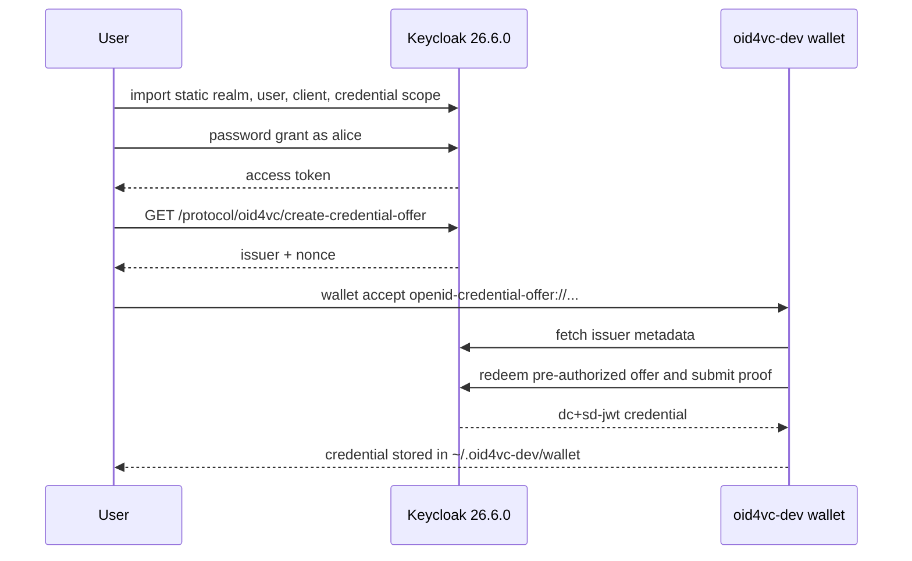

# Keycloak Issuer + oid4vc-dev Wallet

This example runs a local OpenID4VCI issuance flow from Keycloak into `oid4vc-dev`.

## How It Works

1. `docker compose up --force-recreate` starts Keycloak `26.6.0`, enables OID4VCI, and imports `realm/oid4vc-demo-realm.json`.
2. `./scripts/bootstrap.sh` only waits for the imported realm to become ready and prints the issuer endpoints.
3. `./scripts/create-offer.sh` logs in as `alice`, calls Keycloak's `create-credential-offer` endpoint, and converts the returned `issuer` and `nonce` into an `openid-credential-offer://` URI.
4. `oid4vc-dev wallet accept` resolves the offer URI, fetches issuer metadata and authorization details from Keycloak, creates proof-of-possession material, and stores the returned SD-JWT VC in the local wallet directory.

## Flow Diagram



## Files

- `start.sh`: starts Keycloak, bootstraps the issuer, and by default redeems a credential into `oid4vc-dev`
- `docker-compose.yml`: starts Keycloak with OID4VCI enabled and imports the realm from `realm/`
- `realm/oid4vc-demo-realm.json`: source-of-truth Keycloak realm config for the example
- `scripts/bootstrap.sh`: waits for the imported realm and prints the issuer endpoints
- `scripts/create-offer.sh`: creates a fresh pre-authorized offer URI
- `scripts/redeem-offer.sh`: creates an offer and passes it into `oid4vc-dev`

## Quick Start

```bash
cd examples/keycloak-issuer-wallet
./start.sh
oid4vc-dev wallet list
```

If `oid4vc-dev` is not already installed, `start.sh` installs the latest release with `go install github.com/dominikschlosser/oid4vc-dev@latest`.

Setup only:

```bash
./start.sh --setup-only
```

Manual flow:

```bash
OFFER_URI=$(./scripts/create-offer.sh)
oid4vc-dev wallet accept "$OFFER_URI"
```

## Parameters

### Keycloak

| Parameter | Value |
|---|---|
| Image | `quay.io/keycloak/keycloak:26.6.0` |
| Startup flags | `start-dev`, `--features=oid4vc-vci:v1,oid4vc-vci-preauth-code:v1`, `--http-port=8080`, `--proxy-headers=xforwarded` |
| Realm | `oid4vc-demo` |
| Admin user | `admin` / `admin` |
| Demo user | `alice` / `alice` |
| OIDC client | `oid4vc-demo-client` |
| Client type | public client |
| Client attributes | `oid4vci.enabled=true`, `pkce.code.challenge.method=S256` |
| Redirect URIs | `*` |
| Credential configuration ID | `membership-credential` |
| Credential format | `dc+sd-jwt` |
| `vct` | `https://credentials.example.com/membership` |
| Signing algorithm | `ES256` |
| Binding requirement | `vc.binding_required=true` |
| Proof types | `vc.binding_required_proof_types=jwt` |
| Binding methods | `vc.cryptographic_binding_methods_supported=jwk` |
| Credential identifier | `membership-credential-id` |
| Claims | `given_name`, `family_name`, `email`, `jti`, `iat` |
| Offer endpoint | `/realms/oid4vc-demo/protocol/oid4vc/create-credential-offer` |
| Issuer metadata | `/realms/oid4vc-demo/.well-known/openid-credential-issuer` |

### oid4vc-dev

| Parameter | Value |
|---|---|
| Wallet directory | `~/.oid4vc-dev/wallet` |
| Input | `openid-credential-offer://?credential_offer_uri=...` |
| Storage result | imported `dc+sd-jwt` VC in local wallet store |

## Useful Overrides

```bash
KEYCLOAK_BASE_URL=http://localhost:8080
KEYCLOAK_REALM=oid4vc-demo
OID4VCI_CLIENT_ID=oid4vc-demo-client
OID4VCI_CREDENTIAL_SCOPE=membership-credential
OID4VCI_USER=alice
OID4VCI_USER_PASSWORD=alice
```

## Cleanup

```bash
docker compose down -v
oid4vc-dev wallet remove --all
```
