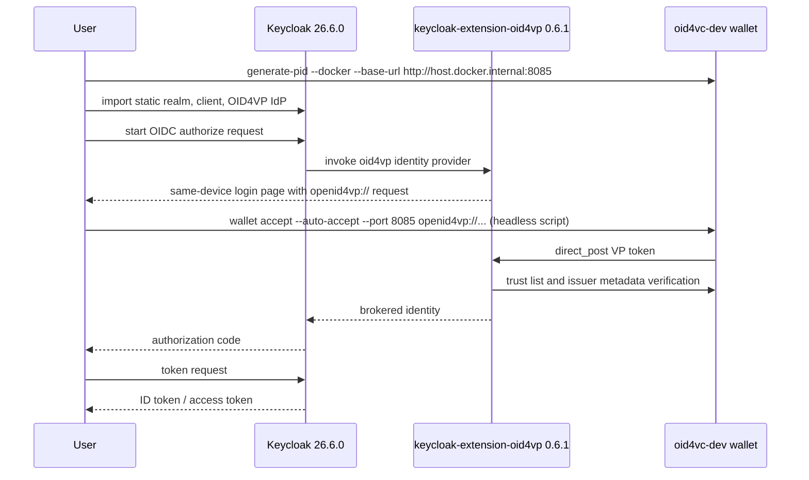

# Keycloak Verifier + `keycloak-extension-oid4vp`

This example runs a local same-device OpenID4VP login against Keycloak using `oid4vc-dev` as the wallet.

## How It Works

1. `./scripts/download-extension.sh` downloads `keycloak-extension-oid4vp` `0.6.1` into `providers/`.
2. `./scripts/generate-wallet.sh` prepares the standard `oid4vc-dev` wallet with PID credentials and a trust list endpoint reachable from Docker as `http://host.docker.internal:8085`.
3. `docker compose up --force-recreate` starts Keycloak `26.6.0`, mounts `realm/wallet-demo-realm.json`, imports the realm on startup, and loads the OID4VP provider jar.
4. `./scripts/bootstrap.sh` only waits for the imported realm to become ready and prints the public endpoints.
5. `./scripts/login.py` starts the OIDC browser login, extracts the `openid4vp://` request, hands it to `oid4vc-dev wallet accept --auto-accept` for the automated headless path, follows the broker flow, and exchanges the returned code for tokens.

## Flow Diagram



## Files

- `start.sh`: runs the full setup and by default executes the headless same-device verifier flow
- `docker-compose.yml`: starts Keycloak, mounts provider jars from `providers/`, and imports the realm from `realm/`
- `realm/wallet-demo-realm.json`: source-of-truth Keycloak realm config for the example
- `scripts/download-extension.sh`: downloads `keycloak-extension-oid4vp` `0.6.1`
- `scripts/bootstrap.sh`: waits for the imported realm and prints the useful endpoints
- `scripts/generate-wallet.sh`: creates the wallet, PID credentials, wallet CA, and trust list endpoint
- `scripts/login.py`: runs the same-device flow end to end and exchanges the returned code
- `scripts/test-oidc-flow.sh`: starts a browser-driven flow for a system-registered `oid4vc-dev` wallet

## Quick Start

```bash
cd examples/keycloak-verifier-oid4vp
./start.sh
```

If `oid4vc-dev` is not already installed, `start.sh` installs the latest release with `go install github.com/dominikschlosser/oid4vc-dev@latest`.

Browser-driven flow:

```bash
./start.sh --browser
```

`./start.sh --browser` runs `oid4vc-dev wallet register` automatically. On macOS that installs the custom scheme handlers. On Linux and Windows it is a no-op, so when Keycloak shows the wallet page, copy the `openid4vp://...` link target and run:

```bash
oid4vc-dev wallet accept '<openid4vp://...>'
```

Setup only:

```bash
./start.sh --setup-only
```

## Parameters

### Keycloak

| Parameter | Value |
|---|---|
| Image | `quay.io/keycloak/keycloak:26.6.0` |
| Startup flags | `start-dev`, `--http-port=8080`, `--proxy-headers=xforwarded`, `--truststore-paths=/opt/keycloak/conf/oid4vc-wallet-ca.pem`, `--tls-hostname-verifier=ANY` |
| Mounted provider jar | `providers/keycloak-extension-oid4vp.jar` |
| Realm | `wallet-demo` |
| Admin user | `admin` / `admin` |
| OIDC client | `wallet-mock` |
| Redirect URIs | `*` |
| Client attributes | `pkce.code.challenge.method=S256` |

### `keycloak-extension-oid4vp`

| Parameter | Value |
|---|---|
| Version | `0.6.1` |
| Provider alias | `oid4vp` |
| `firstBrokerLoginFlowAlias` | `first broker login` |
| `sameDeviceEnabled` | `true` |
| `crossDeviceEnabled` | `false` |
| `walletScheme` | `openid4vp://` |
| `responseMode` | `direct_post` |
| `clientIdScheme` | `plain` |
| `enforceHaip` | `false` |
| `trustedAuthoritiesMode` | `none` |
| `trustListUrl` | `http://host.docker.internal:8085/api/trustlist` |
| `trustListLoTEType` | `http://uri.etsi.org/19602/LoTEType/EUPIDProvidersList` |
| `userMappingClaim` | `family_name` |
| `userMappingClaimMdoc` | `family_name` |
| DCQL credential id | `pid_sd_jwt` |
| DCQL format | `dc+sd-jwt` |
| DCQL `vct` | `urn:eudi:pid:de:1` |
| DCQL requested claims | `family_name`, `given_name`, `birthdate` |

### oid4vc-dev

| Parameter | Value |
|---|---|
| Wallet store | `~/.oid4vc-dev/wallet` |
| Wallet base URL during wallet generation | `http://host.docker.internal:8085` |
| Wallet port during presentation | `8085` |
| Trust list endpoint on host | `http://localhost:8085/api/trustlist` |
| Trust list endpoint from Docker | `http://host.docker.internal:8085/api/trustlist` |

## Useful Overrides

```bash
KEYCLOAK_BASE_URL=http://localhost:8080
KEYCLOAK_REALM=wallet-demo
OIDC_CLIENT_ID=wallet-mock
OIDC_REDIRECT_URI=http://127.0.0.1:18080/callback
OID4VP_TRUST_LIST_URL=http://host.docker.internal:8085/api/trustlist
OID4VP_TRUST_LIST_LOTE_TYPE=http://uri.etsi.org/19602/LoTEType/EUPIDProvidersList
OID4VC_WALLET_PORT=8085
```

## Cleanup

```bash
docker compose down -v
oid4vc-dev wallet remove --all
rm -f wallet-ca-cert.pem wallet-ca-key.pem
```
